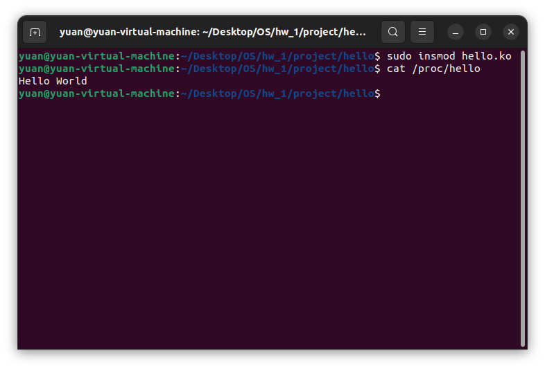

# OS HW1
## 2.24
step 1:
```bash=
strace ./FileCopy
```


step 2:
#### enter input & copy


step 3:
#### done


## 3.19
### Pipe
step 1:
```bash=
./time mkdir test_dir
```


step 2:
#### done


### Shared Memory

step 1:
```bash=
./time mkdir test_dir
```


step 2:
#### done


## 3.21
step 1:
```bash=
./main
35
```


step 2:
#### done


## 3.27
step 1:
#### enter something into input.txt &
```bash=
./filecopy input.txt copy.txt
```


step 2:
#### done & check copy.txt

## project
#### entire code all made by Hung-Yuan, Hsiao 110590063

### simple
step 1:
```bash=
sudo dmesg -C #TO CLEAR DMESSG
```

step 2:
```bash=
sudo insmod simple.ko
```

step 3:
```bash=
sudo dmesg
```


step 4:
```bash=
sudo rmmod simple
```
step 5:
```bash=
sudo dmesg
```


### hello
step 1:
```bash=
sudo insmod hello.ko
```

step 2:
```bash=
cat /proc/hello
```


step 4:
```bash=
sudo rmmod hello
```

### jiffies
step 1:
```bash=
sudo insmod jiffies.ko
```

step 2:
```bash=
cat /proc/jiffies
```


step 3:
```bash=
sudo rmmod hello
```

### seconds
```bash=
sudo insmod seconds.ko
```

step 2:
```bash=
cat /proc/seconds
```


step 3:
```bash=
sudo rmmod seconds
```
